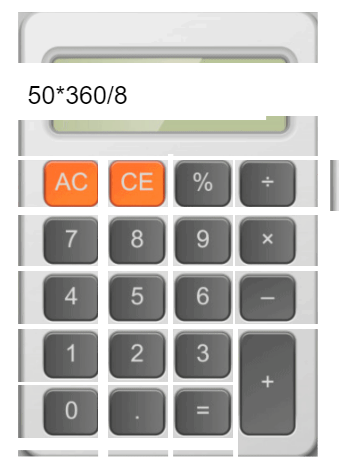
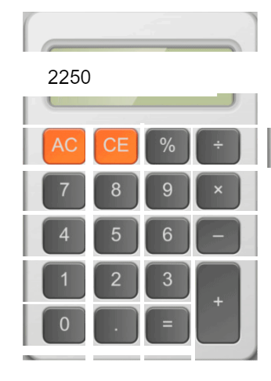

# animation_calculator
The final result (adobe animate calculator)

I did this from a to z alone
you can click on the buttons or use keyboard keys

to clear  click on d then click on c CE
to remove last char click on AC

